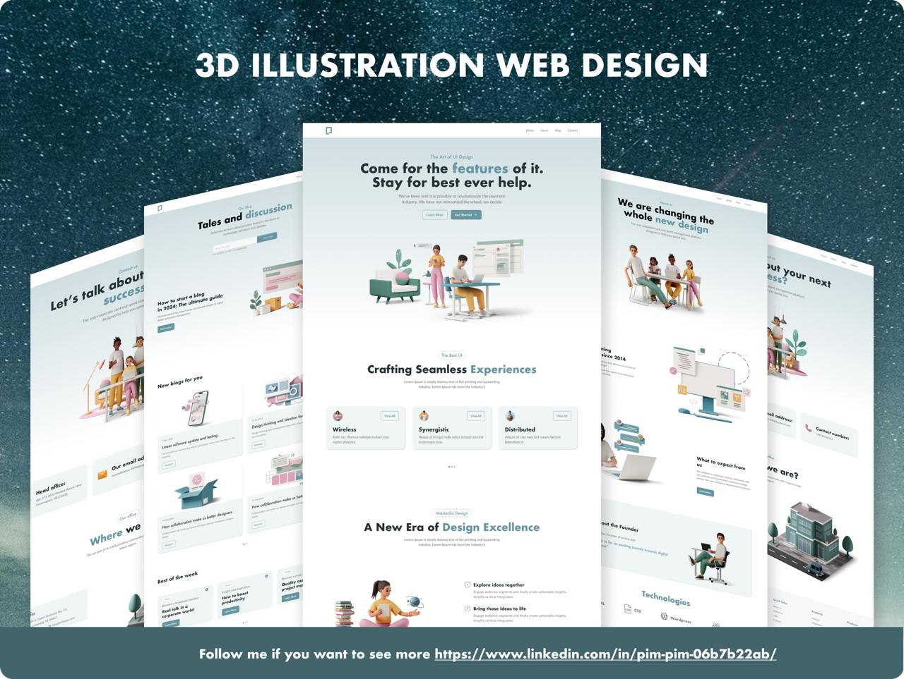

# 3D-illustration Site

## Description

This is the first project of our team participating in MMS Connections program. We practised team-git folw, layout and animations. And we focused on connection-improvement between team members and collaborative skill.

## Authors

* Myo Min Thein  [@github](https://github.com/Vee-Scored)
* Aung Myat Moe [@github](https://github.com/blankverse123000)
* Zarmani [@github](https://github.com/zarmani-dev)
* Aung Kaung San [@github](https://github.com/ArrKuu77)
* Han Htun Aung [@github](https://github.com/Hanhtunaung97)

### What I've contributed

* Github host
* Hero Section, Header

## Project Link

[Visit the Project Website](https://3d-illustration-mcf3.vercel.app/)